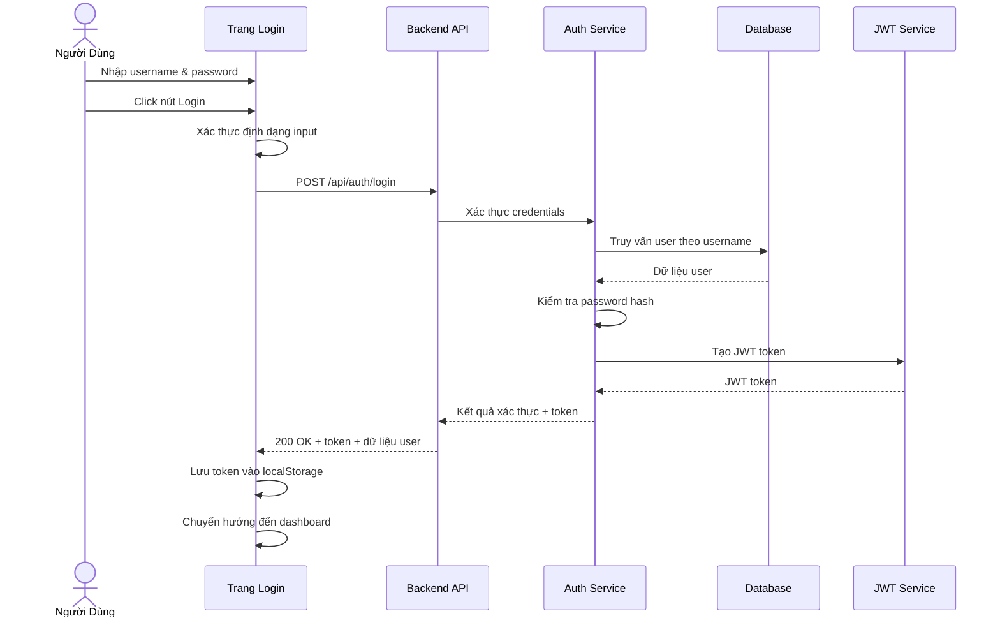

# Tính Năng Login - Phân Tích Yêu Cầu

**Ngày:** 22 Tháng 11, 2025
**Dự Án:** FloginFE_BE - Đăng Nhập & Quản Lý Sản Phẩm
**Tính Năng:** Xác Thực Đăng Nhập Người Dùng

---

## 1. Tổng Quan

Tài liệu này cung cấp phân tích toàn diện về các yêu cầu của tính năng Login, bao gồm các quy tắc xác thực, luồng xác thực và cơ chế xử lý lỗi. Phân tích này đóng vai trò là nền tảng cho việc thiết kế các test scenario và test case.

---

## 2. Các Quy Tắc Xác Thực

### 2.1 Quy Tắc Xác Thực Username

| Mã Quy Tắc | Mô Tả Quy Tắc | Chi Tiết |
|------------|---------------|----------|
| VR_USER_01 | Yêu Cầu Độ Dài | Phải từ 3 đến 50 ký tự (bao gồm cả 2 đầu mút) |
| VR_USER_02 | Bộ Ký Tự | Chỉ cho phép ký tự chữ và số: `a-z`, `A-Z`, `0-9` |
| VR_USER_03 | Trường Bắt Buộc | Username không được để trống hoặc null |
| VR_USER_04 | Không Ký Tự Đặc Biệt | Không cho phép ký tự đặc biệt (vd: `!@#$%^&*()`) |
| VR_USER_05 | Không Khoảng Trắng | Không cho phép khoảng trắng ở đầu, cuối hoặc giữa |
| VR_USER_06 | Phân Biệt Hoa Thường | Username có phân biệt chữ hoa chữ thường |

**Ví Dụ Username Hợp Lệ:**
- `user123` ✅
- `TestUser` ✅
- `abc` (độ dài tối thiểu) ✅
- `User1234567890ABCDEFGHIJKLMNOPQRSTUVWXYZ12345678` (50 ký tự) ✅

**Ví Dụ Username Không Hợp Lệ:**
- `ab` ❌ (quá ngắn)
- `user@name` ❌ (chứa ký tự đặc biệt)
- `user name` ❌ (chứa khoảng trắng)
- `` ❌ (trống)

---

### 2.2 Quy Tắc Xác Thực Password

| Mã Quy Tắc | Mô Tả Quy Tắc | Chi Tiết |
|------------|---------------|----------|
| VR_PASS_01 | Yêu Cầu Độ Dài | Phải từ 6 đến 100 ký tự (bao gồm cả 2 đầu mút) |
| VR_PASS_02 | Thành Phần Ký Tự | Phải chứa CẢ chữ cái (a-z, A-Z) VÀ số (0-9) |
| VR_PASS_03 | Trường Bắt Buộc | Password không được để trống hoặc null |
| VR_PASS_04 | Ký Tự Đặc Biệt | Ký tự đặc biệt được phép nhưng không bắt buộc |
| VR_PASS_05 | Phân Biệt Hoa Thường | Password có phân biệt chữ hoa chữ thường |
| VR_PASS_06 | Không Chỉ Khoảng Trắng | Password không được chỉ toàn khoảng trắng |

**Ví Dụ Password Hợp Lệ:**
- `Pass123` ✅ (có cả chữ và số)
- `abc123` ✅ (độ dài tối thiểu với chữ và số)
- `MyP@ssw0rd!` ✅ (ký tự đặc biệt được phép)
- `Test1234567890` ✅

**Ví Dụ Password Không Hợp Lệ:**
- `Pass1` ❌ (quá ngắn)
- `Password` ❌ (không có số)
- `123456` ❌ (không có chữ)
- `` ❌ (trống)

---

## 3. Luồng Xác Thực

### 3.1 Luồng Xác Thực Thành Công (Happy Path)



### 3.2 Các Bước Xác Thực

1. **Xác Thực Phía Client**
   - Xác thực định dạng username (3-50 ký tự, chữ và số)
   - Xác thực định dạng password (6-100 ký tự, chữ + số)
   - Hiển thị lỗi xác thực ngay lập tức nếu định dạng không hợp lệ

2. **Yêu Cầu API**
   - Phương thức: `POST`
   - Endpoint: `/api/auth/login`
   - Content-Type: `application/json`
   - Request Body:
     ```json
     {
       "username": "string",
       "password": "string"
     }
     ```

3. **Xử Lý Phía Server**
   - Xác thực request payload
   - Truy vấn database tìm user theo username
   - So sánh password hash sử dụng BCrypt
   - Nếu thành công, tạo JWT token với:
     - User ID
     - Username
     - Thời gian hết hạn (có thể cấu hình)

4. **Xử Lý Response**
   - **Thành Công (200 OK):**
     ```json
     {
       "success": true,
       "message": "Đăng nhập thành công",
       "token": "eyJhbGciOiJIUzI1NiIsInR5cCI6IkpXVCJ9...",
       "user": {
         "id": 1,
         "username": "testuser"
       }
     }
     ```
   - Lưu JWT token vào localStorage/sessionStorage
   - Chuyển hướng user đến dashboard

5. **Lưu Trữ & Sử Dụng Token**
   - Lưu JWT token một cách bảo mật
   - Bao gồm token trong Authorization header cho các request tiếp theo:
     ```
     Authorization: Bearer <token>
     ```

---

## 4. Xử Lý Lỗi

### 4.1 Lỗi Xác Thực Phía Client

| Mã Lỗi | Tình Huống | Thông Báo Lỗi | HTTP Status |
|---------|-----------|----------------|-------------|
| ERR_USER_EMPTY | Username trống | "Username là bắt buộc" | N/A (Client) |
| ERR_USER_SHORT | Username < 3 ký tự | "Username phải có ít nhất 3 ký tự" | N/A (Client) |
| ERR_USER_LONG | Username > 50 ký tự | "Username không được vượt quá 50 ký tự" | N/A (Client) |
| ERR_USER_INVALID | Ký tự không hợp lệ | "Username chỉ được chứa chữ cái và số" | N/A (Client) |
| ERR_PASS_EMPTY | Password trống | "Password là bắt buộc" | N/A (Client) |
| ERR_PASS_SHORT | Password < 6 ký tự | "Password phải có ít nhất 6 ký tự" | N/A (Client) |
| ERR_PASS_LONG | Password > 100 ký tự | "Password không được vượt quá 100 ký tự" | N/A (Client) |
| ERR_PASS_FORMAT | Không có chữ hoặc số | "Password phải chứa cả chữ cái và số" | N/A (Client) |

### 4.2 Lỗi Xác Thực Phía Server

| Mã Lỗi | Tình Huống | Thông Báo Lỗi | HTTP Status |
|---------|-----------|----------------|-------------|
| AUTH_001 | Credentials không hợp lệ | "Username hoặc password không đúng" | 401 Unauthorized |
| AUTH_002 | Tài khoản không tồn tại | "Username hoặc password không đúng" | 401 Unauthorized |
| AUTH_003 | Tài khoản bị khóa | "Tài khoản đã bị khóa. Vui lòng liên hệ hỗ trợ" | 403 Forbidden |
| AUTH_004 | Tài khoản bị vô hiệu hóa | "Tài khoản đã bị vô hiệu hóa" | 403 Forbidden |
| AUTH_005 | Định dạng request không hợp lệ | "Định dạng request không hợp lệ" | 400 Bad Request |
| AUTH_006 | Thiếu trường bắt buộc | "Username và password là bắt buộc" | 400 Bad Request |
| SYS_001 | Lỗi database | "Đã xảy ra lỗi. Vui lòng thử lại sau" | 500 Internal Server Error |
| SYS_002 | Lỗi tạo token | "Xác thực thất bại. Vui lòng thử lại" | 500 Internal Server Error |

**Định Dạng Error Response:**
```json
{
  "success": false,
  "errorCode": "AUTH_001",
  "message": "Username hoặc password không đúng",
  "timestamp": "2025-11-22T10:30:00Z"
}
```

### 4.3 Chiến Lược Xử Lý Lỗi

1. **Tiếp Cận Ưu Tiên Bảo Mật**
   - Không bao giờ tiết lộ username hay password bị sai
   - Sử dụng thông báo chung: "Username hoặc password không đúng"
   - Ngăn chặn tấn công dò tìm username

2. **Thông Báo Thân Thiện Với Người Dùng**
   - Thông báo lỗi rõ ràng, có thể thực hiện
   - Hướng dẫn người dùng sửa lỗi input
   - Hiển thị lỗi gần trường input liên quan

3. **Giới Hạn Tần Suất (Rate Limiting)**
   - Giới hạn số lần đăng nhập để ngăn tấn công brute force
   - Khóa tài khoản sau 5 lần thất bại trong 15 phút
   - Triển khai exponential backoff

4. **Ghi Log & Giám Sát**
   - Ghi log tất cả các lần thử xác thực
   - Giám sát các mẫu đáng ngờ
   - Cảnh báo khi có nhiều lần thử thất bại

---

## 5. Yêu Cầu Phi Chức Năng

### 5.1 Yêu Cầu Bảo Mật

- **Lưu Trữ Password:** Password phải được hash sử dụng BCrypt (cost factor ≥ 10)
- **JWT Token:** Sử dụng thuật toán HS256 với secret key bảo mật
- **Chỉ HTTPS:** Tất cả traffic xác thực phải sử dụng HTTPS
- **Ngăn Chặn XSS:** Làm sạch tất cả input của người dùng
- **Bảo Vệ CSRF:** Triển khai CSRF token cho các thao tác thay đổi trạng thái

### 5.2 Yêu Cầu Hiệu Năng

- Request đăng nhập phải hoàn thành trong vòng 2 giây ở tải bình thường
- Hỗ trợ ít nhất 100 request đăng nhập đồng thời
- Tối ưu hóa truy vấn database để tra cứu user

### 5.3 Yêu Cầu Trải Nghiệm Người Dùng

- Hiển thị nút toggle hiển thị password
- Tùy chọn ghi nhớ username (tùy chọn)
- Thông báo lỗi rõ ràng
- Hiển thị loading indicator trong quá trình xác thực

---

## 6. Quy Tắc Nghiệp Vụ

1. **Username Duy Nhất:** Mỗi username phải là duy nhất trong hệ thống
2. **Chính Sách Password:** Người dùng phải đặt password đáp ứng yêu cầu xác thực
3. **Quản Lý Phiên:** JWT token hết hạn sau thời gian có thể cấu hình (mặc định: 24 giờ)
4. **Phiên Đồng Thời:** Cho phép nhiều phiên hoạt động cho mỗi user
5. **Khóa Tài Khoản:** Khóa tạm thời sau 5 lần đăng nhập thất bại

---

## 7. Giả Định

1. Tài khoản người dùng được đăng ký trước thông qua quy trình đăng ký riêng
2. Chức năng reset password có sẵn thông qua luồng riêng
3. Xác thực hai yếu tố (2FA) không được triển khai trong giai đoạn này
4. Đăng nhập một lần (SSO) không được hỗ trợ trong phiên bản này

---

## 8. Ngoài Phạm Vi

- Đăng ký người dùng
- Reset password/quên password
- Đăng nhập mạng xã hội (OAuth)
- Xác thực hai yếu tố (2FA)
- Xác thực sinh trắc học
- Chức năng ghi nhớ đăng nhập với token lâu dài

---

## 9. Phụ Thuộc

- **Backend:** Spring Boot, Spring Security, thư viện JWT (jjwt)
- **Database:** PostgreSQL (production), H2 (development/testing)
- **Frontend:** React, Axios cho API calls
- **Security:** BCrypt cho password hashing

---

## 10. Tiêu Chí Chấp Nhận

✅ Người dùng có thể đăng nhập thành công với credentials hợp lệ
✅ Credentials không hợp lệ bị từ chối với thông báo lỗi phù hợp
✅ Xác thực phía client ngăn chặn submit định dạng không hợp lệ
✅ JWT token được tạo và lưu trữ khi đăng nhập thành công
✅ Người dùng được chuyển hướng đến dashboard sau khi đăng nhập thành công
✅ Tất cả quy tắc xác thực được thực thi nhất quán
✅ Thông báo lỗi rõ ràng và thân thiện với người dùng
✅ Quy trình xác thực hoàn thành trong yêu cầu hiệu năng
✅ Tuân thủ các thực hành tốt nhất về bảo mật (password hashing, lưu trữ token bảo mật)
✅ Các lần thử đăng nhập thất bại được ghi log để giám sát bảo mật
