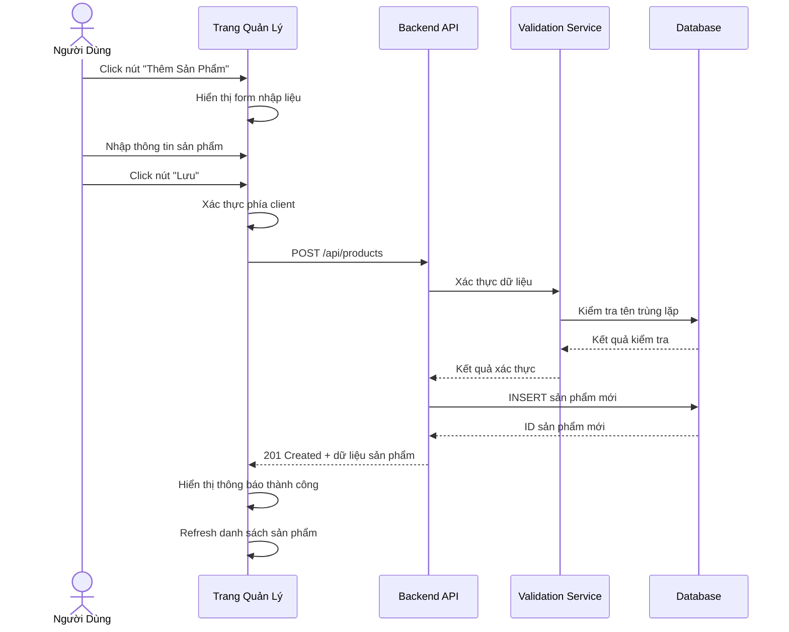
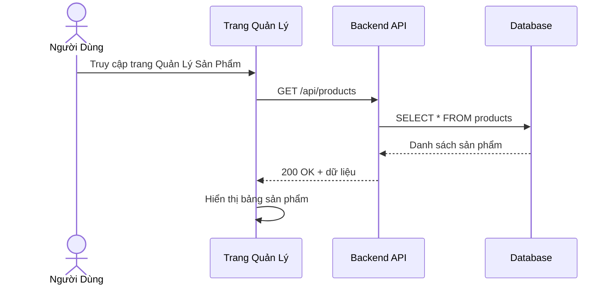
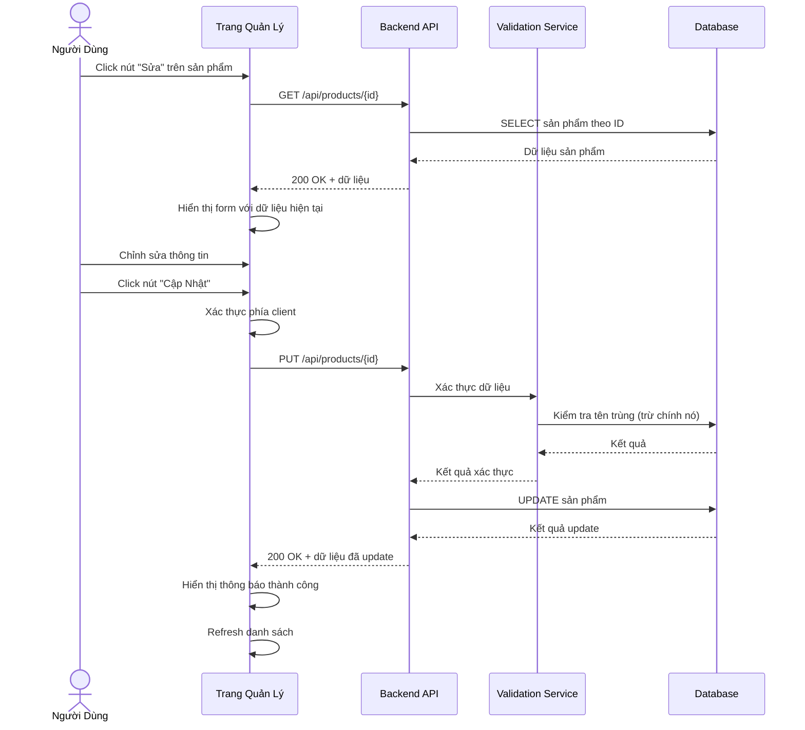
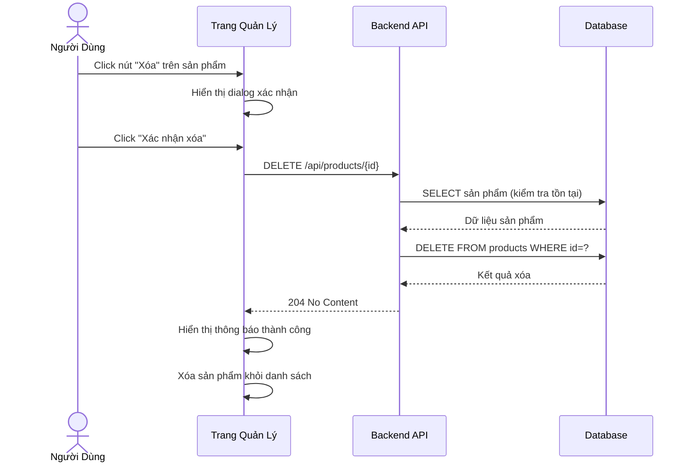

# Tính Năng Quản Lý Sản Phẩm - Phân Tích Yêu Cầu

**Ngày:** 22 Tháng 11, 2025
**Dự Án:** FloginFE_BE - Đăng Nhập & Quản Lý Sản Phẩm
**Tính Năng:** Quản Lý Sản Phẩm (CRUD Operations)

---

## 1. Tổng Quan

Tài liệu này cung cấp phân tích toàn diện về các yêu cầu của tính năng Quản Lý Sản Phẩm, bao gồm các quy tắc xác thực, luồng nghiệp vụ CRUD (Create, Read, Update, Delete) và cơ chế xử lý lỗi. Phân tích này đóng vai trò là nền tảng cho việc thiết kế các test scenario và test case.

---

## 2. Các Quy Tắc Xác Thực

### 2.1 Quy Tắc Xác Thực Tên Sản Phẩm

| Mã Quy Tắc | Mô Tả Quy Tắc | Chi Tiết |
|------------|---------------|----------|
| VR_PROD_01 | Yêu Cầu Độ Dài | Phải từ 3 đến 100 ký tự (bao gồm cả 2 đầu mút) |
| VR_PROD_02 | Trường Bắt Buộc | Tên sản phẩm không được để trống hoặc null |
| VR_PROD_03 | Ký Tự Cho Phép | Cho phép chữ, số, khoảng trắng và một số ký tự đặc biệt (dấu gạch ngang, gạch dưới) |
| VR_PROD_04 | Không Chỉ Khoảng Trắng | Tên không được chỉ chứa khoảng trắng |
| VR_PROD_05 | Trim Khoảng Trắng | Tự động loại bỏ khoảng trắng ở đầu và cuối |
| VR_PROD_06 | Tên Duy Nhất | Tên sản phẩm phải là duy nhất trong hệ thống |

**Ví Dụ Tên Sản Phẩm Hợp Lệ:**
- `Laptop Dell XPS 13` ✅
- `Điện thoại iPhone 15 Pro` ✅
- `Tai nghe Sony WH-1000XM5` ✅
- `ABC` (độ dài tối thiểu) ✅

**Ví Dụ Tên Sản Phẩm Không Hợp Lệ:**
- `AB` ❌ (quá ngắn)
- `` ❌ (trống)
- `   ` ❌ (chỉ khoảng trắng)
- Tên đã tồn tại trong hệ thống ❌ (trùng lặp)

---

### 2.2 Quy Tắc Xác Thực Giá Sản Phẩm

| Mã Quy Tắc | Mô Tả Quy Tắc | Chi Tiết |
|------------|---------------|----------|
| VR_PRICE_01 | Giá Trị Dương | Giá phải lớn hơn 0 |
| VR_PRICE_02 | Giá Trị Tối Đa | Giá không được vượt quá 999,999,999 VNĐ |
| VR_PRICE_03 | Trường Bắt Buộc | Giá không được để trống hoặc null |
| VR_PRICE_04 | Định Dạng Số | Phải là số nguyên hoặc số thập phân (tối đa 2 chữ số thập phân) |
| VR_PRICE_05 | Không Âm | Không chấp nhận giá trị âm |

**Ví Dụ Giá Hợp Lệ:**
- `1000` ✅ (1,000 VNĐ)
- `25000000` ✅ (25,000,000 VNĐ)
- `999999999` ✅ (999,999,999 VNĐ - tối đa)
- `15000.50` ✅ (có thập phân)

**Ví Dụ Giá Không Hợp Lệ:**
- `0` ❌ (không dương)
- `-5000` ❌ (âm)
- `1000000000` ❌ (vượt quá giới hạn)
- `` ❌ (trống)

---

### 2.3 Quy Tắc Xác Thực Số Lượng

| Mã Quy Tắc | Mô Tả Quy Tắc | Chi Tiết |
|------------|---------------|----------|
| VR_QTY_01 | Không Âm | Số lượng phải lớn hơn hoặc bằng 0 |
| VR_QTY_02 | Giá Trị Tối Đa | Số lượng không được vượt quá 99,999 |
| VR_QTY_03 | Trường Bắt Buộc | Số lượng không được để trống hoặc null |
| VR_QTY_04 | Số Nguyên | Phải là số nguyên (không chấp nhận thập phân) |
| VR_QTY_05 | Giá Trị Mặc Định | Mặc định là 0 nếu không được cung cấp |

**Ví Dụ Số Lượng Hợp Lệ:**
- `0` ✅ (hết hàng)
- `100` ✅
- `99999` ✅ (tối đa)
- `5000` ✅

**Ví Dụ Số Lượng Không Hợp Lệ:**
- `-10` ❌ (âm)
- `100000` ❌ (vượt quá giới hạn)
- `50.5` ❌ (không nguyên)
- `` ❌ (trống)

---

### 2.4 Quy Tắc Xác Thực Mô Tả

| Mã Quy Tắc | Mô Tả Quy Tắc | Chi Tiết |
|------------|---------------|----------|
| VR_DESC_01 | Độ Dài Tối Đa | Không được vượt quá 500 ký tự |
| VR_DESC_02 | Trường Tùy Chọn | Có thể để trống (không bắt buộc) |
| VR_DESC_03 | Ký Tự Cho Phép | Cho phép tất cả ký tự Unicode |
| VR_DESC_04 | Trim Khoảng Trắng | Tự động loại bỏ khoảng trắng ở đầu và cuối |

**Ví Dụ Mô Tả Hợp Lệ:**
- `Laptop cao cấp, màn hình 13 inch, RAM 16GB` ✅
- `` ✅ (trống - cho phép)
- Mô tả dài 500 ký tự ✅
- `Điện thoại thông minh với camera 48MP, pin 5000mAh` ✅

**Ví Dụ Mô Tả Không Hợp Lệ:**
- Mô tả dài hơn 500 ký tự ❌

---

### 2.5 Quy Tắc Xác Thực Danh Mục

| Mã Quy Tắc | Mô Tả Quy Tắc | Chi Tiết |
|------------|---------------|----------|
| VR_CAT_01 | Trường Bắt Buộc | Danh mục không được để trống hoặc null |
| VR_CAT_02 | Giá Trị Hợp Lệ | Phải là một trong các danh mục được định nghĩa trước |
| VR_CAT_03 | Tồn Tại Trong Hệ Thống | ID danh mục phải tồn tại trong bảng categories |

**Danh Mục Được Định Nghĩa:**
- `Điện tử` (Electronics)
- `Thời trang` (Fashion)
- `Gia dụng` (Home & Living)
- `Thực phẩm` (Food & Beverage)
- `Sách` (Books)
- `Thể thao` (Sports)
- `Khác` (Others)

**Ví Dụ Danh Mục Hợp Lệ:**
- `Điện tử` ✅
- `Thời trang` ✅

**Ví Dụ Danh Mục Không Hợp Lệ:**
- `` ❌ (trống)
- `Danh mục không tồn tại` ❌
- `null` ❌

---

## 3. Các Luồng Nghiệp Vụ CRUD

### 3.1 Luồng Tạo Sản Phẩm (Create)



**Các Bước Chi Tiết:**

1. **Hiển Thị Form**
   - User click nút "Thêm Sản Phẩm"
   - Hiển thị modal/form với các trường:
     * Tên sản phẩm (bắt buộc)
     * Giá (bắt buộc)
     * Số lượng (bắt buộc)
     * Mô tả (tùy chọn)
     * Danh mục (bắt buộc - dropdown)

2. **Nhập Dữ Liệu**
   - User nhập thông tin vào các trường
   - Xác thực real-time khi user nhập
   - Hiển thị error message ngay lập tức nếu có lỗi

3. **Submit Form**
   - User click nút "Lưu"
   - Xác thực toàn bộ form
   - Nếu có lỗi, hiển thị và không gửi request
   - Nếu hợp lệ, gửi POST request

4. **Xử Lý Phía Server**
   - Xác thực lại dữ liệu
   - Kiểm tra tên sản phẩm trùng lặp
   - Nếu hợp lệ, tạo sản phẩm mới trong database
   - Trả về 201 Created với thông tin sản phẩm

5. **Xử Lý Response**
   - Hiển thị thông báo thành công
   - Đóng form
   - Refresh danh sách sản phẩm
   - Highlight sản phẩm mới tạo

---

### 3.2 Luồng Đọc/Xem Sản Phẩm (Read)

**3.2.1 Xem Danh Sách Sản Phẩm**



**3.2.2 Xem Chi Tiết Sản Phẩm**

- User click vào một sản phẩm trong danh sách
- Gọi API: `GET /api/products/{id}`
- Hiển thị modal/page với thông tin chi tiết
- Bao gồm: Tên, Giá, Số lượng, Mô tả, Danh mục, Ngày tạo, Ngày cập nhật

---

### 3.3 Luồng Cập Nhật Sản Phẩm (Update)



**Lưu Ý Quan Trọng:**
- Khi cập nhật, phải load dữ liệu hiện tại vào form
- Cho phép user thay đổi bất kỳ trường nào
- Xác thực tương tự như Create
- Khi kiểm tra tên trùng, phải loại trừ chính sản phẩm đang sửa
- Cập nhật timestamp `updated_at`

---

### 3.4 Luồng Xóa Sản Phẩm (Delete)



**Lưu Ý Quan Trọng:**
- Luôn hiển thị dialog xác nhận trước khi xóa
- Kiểm tra sản phẩm có tồn tại không
- Có thể implement soft delete (đánh dấu deleted) thay vì hard delete
- Sau khi xóa, remove khỏi UI ngay lập tức (không cần refresh)

---

## 4. Xử Lý Lỗi

### 4.1 Lỗi Xác Thực Phía Client

| Mã Lỗi | Tình Huống | Thông Báo Lỗi | HTTP Status |
|---------|-----------|----------------|-------------|
| ERR_NAME_EMPTY | Tên sản phẩm trống | "Tên sản phẩm là bắt buộc" | N/A (Client) |
| ERR_NAME_SHORT | Tên < 3 ký tự | "Tên sản phẩm phải có ít nhất 3 ký tự" | N/A (Client) |
| ERR_NAME_LONG | Tên > 100 ký tự | "Tên sản phẩm không được vượt quá 100 ký tự" | N/A (Client) |
| ERR_PRICE_EMPTY | Giá trống | "Giá sản phẩm là bắt buộc" | N/A (Client) |
| ERR_PRICE_INVALID | Giá ≤ 0 hoặc không hợp lệ | "Giá phải lớn hơn 0" | N/A (Client) |
| ERR_PRICE_MAX | Giá > 999,999,999 | "Giá không được vượt quá 999,999,999 VNĐ" | N/A (Client) |
| ERR_QTY_EMPTY | Số lượng trống | "Số lượng là bắt buộc" | N/A (Client) |
| ERR_QTY_NEGATIVE | Số lượng < 0 | "Số lượng không được âm" | N/A (Client) |
| ERR_QTY_MAX | Số lượng > 99,999 | "Số lượng không được vượt quá 99,999" | N/A (Client) |
| ERR_QTY_DECIMAL | Số lượng có thập phân | "Số lượng phải là số nguyên" | N/A (Client) |
| ERR_DESC_LONG | Mô tả > 500 ký tự | "Mô tả không được vượt quá 500 ký tự" | N/A (Client) |
| ERR_CAT_EMPTY | Danh mục trống | "Danh mục là bắt buộc" | N/A (Client) |

### 4.2 Lỗi Xác Thực Phía Server

| Mã Lỗi | Tình Huống | Thông Báo Lỗi | HTTP Status |
|---------|-----------|----------------|-------------|
| PROD_001 | Tên sản phẩm trùng lặp | "Tên sản phẩm đã tồn tại trong hệ thống" | 400 Bad Request |
| PROD_002 | Sản phẩm không tồn tại | "Sản phẩm không tồn tại" | 404 Not Found |
| PROD_003 | Dữ liệu không hợp lệ | "Dữ liệu không hợp lệ" | 400 Bad Request |
| PROD_004 | Thiếu trường bắt buộc | "Thiếu thông tin bắt buộc" | 400 Bad Request |
| PROD_005 | Danh mục không tồn tại | "Danh mục không tồn tại" | 400 Bad Request |
| PROD_006 | Không có quyền | "Bạn không có quyền thực hiện thao tác này" | 403 Forbidden |
| SYS_001 | Lỗi database | "Đã xảy ra lỗi. Vui lòng thử lại sau" | 500 Internal Server Error |
| SYS_002 | Lỗi server | "Lỗi hệ thống. Vui lòng liên hệ quản trị viên" | 500 Internal Server Error |

**Định Dạng Error Response:**
```json
{
  "success": false,
  "errorCode": "PROD_001",
  "message": "Tên sản phẩm đã tồn tại trong hệ thống",
  "timestamp": "2025-11-22T10:30:00Z",
  "field": "name"
}
```

### 4.3 Chiến Lược Xử Lý Lỗi

1. **Xác Thực Real-Time**
   - Xác thực khi user đang nhập (on blur)
   - Hiển thị lỗi ngay lập tức
   - Clear error khi user sửa đúng

2. **Thông Báo Thân Thiện**
   - Thông báo rõ ràng, dễ hiểu
   - Hướng dẫn cách sửa lỗi
   - Hiển thị gần trường input có lỗi

3. **Xử Lý Lỗi Server**
   - Hiển thị thông báo lỗi từ server
   - Log lỗi để debug
   - Fallback message cho lỗi không xác định

4. **Ngăn Chặn Submit**
   - Disable nút Submit nếu form có lỗi
   - Highlight các trường có lỗi
   - Scroll đến trường lỗi đầu tiên

---

## 5. API Endpoints

### 5.1 Tạo Sản Phẩm

**Endpoint:** `POST /api/products`

**Request Body:**
```json
{
  "name": "Laptop Dell XPS 13",
  "price": 25000000,
  "quantity": 10,
  "description": "Laptop cao cấp, màn hình 13 inch",
  "categoryId": 1
}
```

**Response (201 Created):**
```json
{
  "success": true,
  "message": "Tạo sản phẩm thành công",
  "data": {
    "id": 1,
    "name": "Laptop Dell XPS 13",
    "price": 25000000,
    "quantity": 10,
    "description": "Laptop cao cấp, màn hình 13 inch",
    "categoryId": 1,
    "categoryName": "Điện tử",
    "createdAt": "2025-11-22T10:30:00Z",
    "updatedAt": "2025-11-22T10:30:00Z"
  }
}
```

---

### 5.2 Lấy Danh Sách Sản Phẩm

**Endpoint:** `GET /api/products`

**Query Parameters:**
- `page` (optional): Số trang (default: 1)
- `size` (optional): Số sản phẩm mỗi trang (default: 10)
- `sort` (optional): Sắp xếp theo trường (vd: `name`, `price`, `createdAt`)
- `order` (optional): Thứ tự sắp xếp (`asc` hoặc `desc`)

**Response (200 OK):**
```json
{
  "success": true,
  "data": {
    "products": [
      {
        "id": 1,
        "name": "Laptop Dell XPS 13",
        "price": 25000000,
        "quantity": 10,
        "categoryName": "Điện tử"
      },
      {
        "id": 2,
        "name": "iPhone 15 Pro",
        "price": 30000000,
        "quantity": 5,
        "categoryName": "Điện tử"
      }
    ],
    "pagination": {
      "currentPage": 1,
      "totalPages": 5,
      "totalItems": 50,
      "itemsPerPage": 10
    }
  }
}
```

---

### 5.3 Lấy Chi Tiết Sản Phẩm

**Endpoint:** `GET /api/products/{id}`

**Response (200 OK):**
```json
{
  "success": true,
  "data": {
    "id": 1,
    "name": "Laptop Dell XPS 13",
    "price": 25000000,
    "quantity": 10,
    "description": "Laptop cao cấp, màn hình 13 inch",
    "categoryId": 1,
    "categoryName": "Điện tử",
    "createdAt": "2025-11-22T10:30:00Z",
    "updatedAt": "2025-11-22T10:30:00Z"
  }
}
```

---

### 5.4 Cập Nhật Sản Phẩm

**Endpoint:** `PUT /api/products/{id}`

**Request Body:**
```json
{
  "name": "Laptop Dell XPS 13 (Cập nhật)",
  "price": 24000000,
  "quantity": 8,
  "description": "Laptop cao cấp, giảm giá",
  "categoryId": 1
}
```

**Response (200 OK):**
```json
{
  "success": true,
  "message": "Cập nhật sản phẩm thành công",
  "data": {
    "id": 1,
    "name": "Laptop Dell XPS 13 (Cập nhật)",
    "price": 24000000,
    "quantity": 8,
    "description": "Laptop cao cấp, giảm giá",
    "categoryId": 1,
    "categoryName": "Điện tử",
    "createdAt": "2025-11-22T10:30:00Z",
    "updatedAt": "2025-11-22T11:00:00Z"
  }
}
```

---

### 5.5 Xóa Sản Phẩm

**Endpoint:** `DELETE /api/products/{id}`

**Response (204 No Content):**
Không có body, chỉ status code 204

**Hoặc (200 OK):**
```json
{
  "success": true,
  "message": "Xóa sản phẩm thành công"
}
```

---

## 6. Yêu Cầu Phi Chức Năng

### 6.1 Yêu Cầu Bảo Mật

- **Xác Thực:** User phải đăng nhập để thực hiện CRUD
- **Phân Quyền:** Chỉ ADMIN và MANAGER mới có quyền Create, Update, Delete
- **Input Sanitization:** Làm sạch tất cả input để ngăn XSS và SQL Injection
- **CSRF Protection:** Token CSRF cho các thao tác POST, PUT, DELETE

### 6.2 Yêu Cầu Hiệu Năng

- Thời gian response API < 1 giây ở tải bình thường
- Hỗ trợ ít nhất 50 request đồng thời
- Pagination cho danh sách sản phẩm (tránh load toàn bộ)
- Cache danh mục để giảm query database

### 6.3 Yêu Cầu Trải Nghiệm Người Dùng

- Form validation real-time
- Loading indicator khi gọi API
- Thông báo rõ ràng khi thành công/thất bại
- Confirm dialog trước khi xóa
- Responsive design cho mobile

---

## 7. Quy Tắc Nghiệp Vụ

1. **Tên Sản Phẩm Duy Nhất:** Không được tạo 2 sản phẩm cùng tên
2. **Giá Hợp Lý:** Giá phải nằm trong khoảng hợp lý (> 0 và ≤ 999,999,999)
3. **Số Lượng Không Âm:** Số lượng có thể là 0 (hết hàng) nhưng không âm
4. **Danh Mục Bắt Buộc:** Mỗi sản phẩm phải thuộc một danh mục
5. **Audit Trail:** Lưu thông tin người tạo, người cập nhật, thời gian

---

## 8. Giả Định

1. User đã đăng nhập và có quyền thực hiện thao tác
2. Danh mục sản phẩm đã được tạo sẵn trong hệ thống
3. Database có index trên trường `name` để tìm kiếm nhanh
4. Không có tính năng upload ảnh trong phiên bản này

---

## 9. Ngoài Phạm Vi

- Upload và quản lý hình ảnh sản phẩm
- Quản lý biến thể sản phẩm (size, màu sắc)
- Quản lý kho hàng phức tạp
- Tích hợp với hệ thống thanh toán
- Báo cáo và thống kê

---

## 10. Phụ Thuộc

- **Backend:** Spring Boot, Spring Data JPA
- **Database:** MySQL/PostgreSQL với table `products` và `categories`
- **Frontend:** React, Axios cho API calls, React Hook Form cho form handling
- **Validation:** Hibernate Validator (backend), Yup/Zod (frontend)

---

## 11. Tiêu Chí Chấp Nhận

✅ User có thể tạo sản phẩm mới với đầy đủ thông tin
✅ User có thể xem danh sách tất cả sản phẩm
✅ User có thể xem chi tiết một sản phẩm
✅ User có thể cập nhật thông tin sản phẩm
✅ User có thể xóa sản phẩm (với xác nhận)
✅ Validation hoạt động đúng cho tất cả các trường
✅ Không cho phép tạo sản phẩm trùng tên
✅ Thông báo lỗi rõ ràng và thân thiện
✅ UI responsive và hoạt động mượt mà
✅ API tuân thủ RESTful conventions

---
